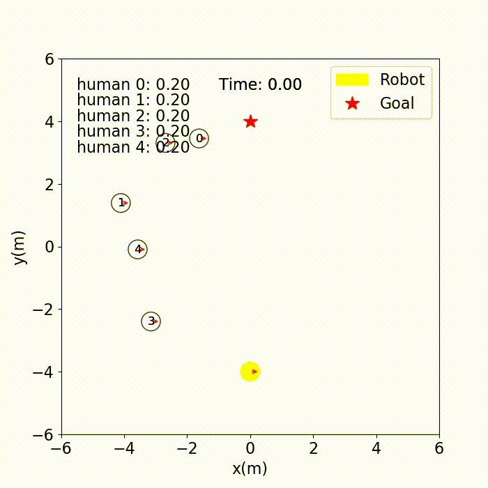
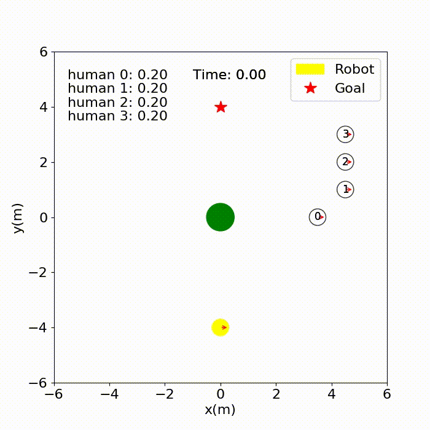
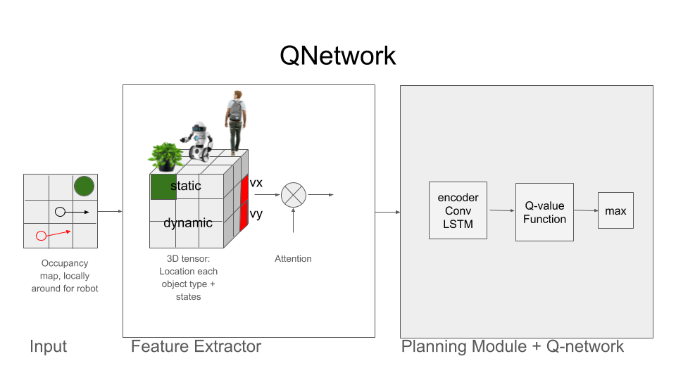

# SocialAwareRobot
Our robot, called Chris, moves among humans and obstacles. It is driven by empowerment to make it social aware.

# What is social intelligence?
- Letting humans pass
- Don't block the way of humans
- Don't change the path of humans
- Don't push humans
- Reach goal in a realistic time!

# How do you achieve this?
We employ three networks:
- The Q-network takes actions that lead to empowered states.
- The forward dynamics network is used to predict a future state from the current state and an action.
- The statistics network is used to generate the mutual information.

# Getting started
If you want to train a policy use the following command:
```
python train.py --policy chris
```

If you want to test a policy, you can use the following command:
```
python test.py --policy chris --model_dir data/output --phase test --visualize --test_case 0
```

# Result




# Architecture 




