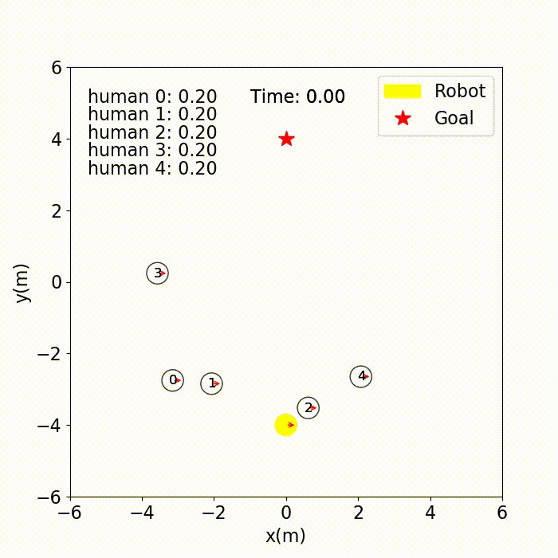

# SocialAwareRobot
Robot moving among humans and obstacles driven by empowerment to make it social aware.

# What is social intelligence?
- Letting humans pass
- Don't block the way of humans
- Don't change the path of humans
- Don't push humans
- Reach goal in a realistic time!

# How do you achieve this?

# Result

# Architecture and implementation details

